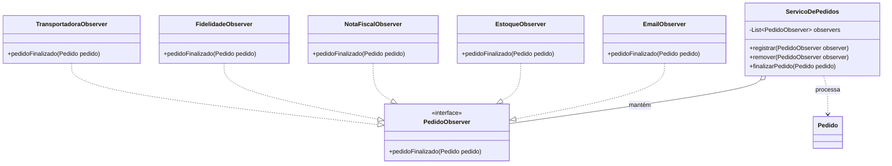

# 🛒 Sistema de Gestão de Pedidos v2.0 - Com Observer

Este projeto é uma implementação robusta do padrão de projeto comportamental **Observer**, desenvolvido como trabalho final para a disciplina de **Programação Orientada a Objetos Avançada**.

*   **Curso:** Bacharelado em Engenharia de Software
*   **Disciplina:** Programação Orientada a Objetos Avançada
*   **Professor:** Mario Jorge
*   **Semestre:** 4º Semestre (2026.2)
*   **Equipe:**
    *   Emanuel Ferreira
    *   Filipe Pinho
    *   Kauã Araújo 
    *   Marcio Ventura
    *   Rodrigo dos Santos

## Arquitetura do Projeto

O sistema simula o fluxo de finalização de um pedido em um e-commerce, onde diversos sistemas periféricos precisam reagir ao evento de "pedido finalizado" de forma independente e desacoplada. A aplicação foca no desacoplamento entre o **Sujeito (Subject)** e seus **Observadores (Observers)**.

### Diagrama de Classes (Mermaid)



### Componentes Principais

1.  **Sujeito (`ServicoDePedidos`)**: Gerencia a lista de observadores e notifica-os quando um pedido é concluído. Não conhece as implementações concretas dos observadores.
2.  **Interface Observer (`PedidoObserver`)**: Define o contrato que todas as ações pós-venda devem seguir.
3.  **Observadores Concretos**:
    *   `EmailObserver`: Envio de comunicações.
    *   `EstoqueObserver`: Abatimento de inventário.
    *   `NotaFiscalObserver`: Emissão de documentos fiscais.
    *   `FidelidadeObserver`: Cálculo de pontos/recompensas.
    *   `TransportadoraObserver`: Agendamento de logística.

## Como Rodar Localmente?

### 1. Clonando o Repositório
```bash
git clone https://github.com/SEU-USUARIO/projeto-observer-poo-avancada.git
cd projeto-observer-poo-avancada
```

### 2. Selecionando essa versão
Rode o código abaixo para selecionar a versão 2.0.
```bash
git checkout v2.0-com-observer
```

### 3. Execução por Sistema Operacional
Se você utiliza o Eclipse, VS Code ou IntelliJ, basta abrir a pasta raiz e clicar em **Run** na classe Main.java. A IDE cuidará da compilação automaticamente.

#### 🐧 Linux e 🍎 macOS
```bash
mkdir -p bin
javac -d bin -sourcepath src src/br/com/loja/Main.java
java -cp bin br.com.loja.Main
```

#### 🪟 Windows
```cmd
if not exist bin mkdir bin
javac -d bin -sourcepath src src/br/com/loja/Main.java
java -cp bin br.com.loja.Main
```