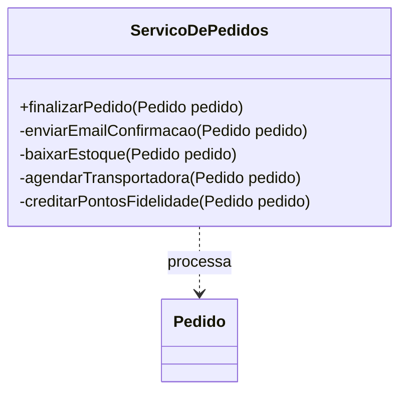

# 🛒 Sistema de Gestão de Pedidos v1.0 - Versão Sem Observer

Este projeto representa a versão inicial do sistema de gestão de pedidos, utilizada como base para demonstrar os problemas de acoplamento rígido antes da aplicação de padrões de projeto.

*   **Curso:** Bacharelado em Engenharia de Software
*   **Disciplina:** Programação Orientada a Objetos Avançada
*   **Professor:** Mario Jorge
*   **Semestre:** 4º Semestre (2026.2)
*   **Equipe:**
    *   Emanuel Ferreira
    *   Filipe Pinho
    *   Kauã Araújo 
    *   Marcio Ventura
    *   Rodrigo dos Santos

## Problema: Acoplamento Rígido

Nesta versão, a classe `ServicoDePedidos` possui **múltiplas responsabilidades**. Ela não apenas finaliza o pedido, mas também conhece todos os detalhes de:
*   Envio de E-mail
*   Baixa de Estoque
*   Agendamento de Logística
*   Cálculo de Pontos de Fidelidade

### Por que esta solução é inadequada?
1.  **Violação do SRP (Single Responsibility Principle)**: O serviço faz coisas demais.
2.  **Violação do OCP (Open/Closed Principle)**: Se precisarmos adicionar uma nova ação (ex: emissão de Nota Fiscal), teremos que modificar o código da classe `ServicoDePedidos`.
3.  **Dificuldade de Manutenção**: O código tende a se tornar um "monolito" difícil de testar e alterar.

## Arquitetura Atual do Código

Atualmente, o fluxo é linear e dependente de métodos privados dentro da mesma classe de serviço.

### Diagrama de Classes (Mermaid)



## Como Rodar Localmente?

### 1. Clonando o Repositório
```bash
git clone https://github.com/SEU-USUARIO/projeto-observer-poo-avancada.git
cd projeto-observer-poo-avancada
```

### 2. Execução por Sistema Operacional

#### 🐧 Linux e 🍎 macOS
```bash
mkdir -p bin
javac -d bin -sourcepath src src/br/com/loja/Main.java
java -cp bin br.com.loja.Main
```

#### 🪟 Windows
```cmd
if not exist bin mkdir bin
javac -d bin -sourcepath src src/br/com/loja/Main.java
java -cp bin br.com.loja.Main
```
