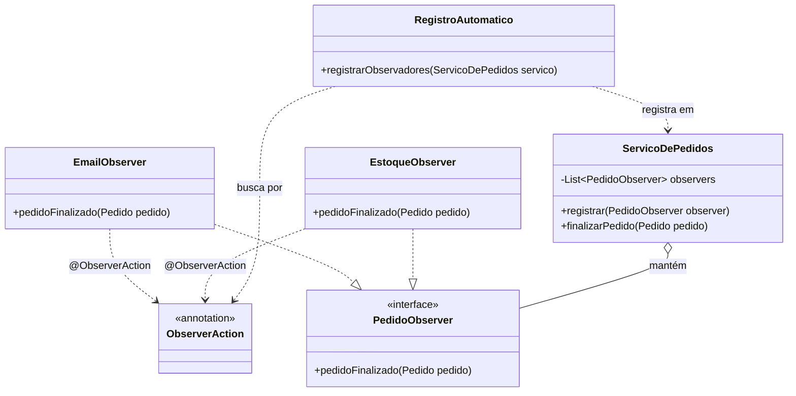

# 🛒 Sistema de Gestão de Pedidos v3.0 - Padrão Observer + Reflexão

Este projeto é uma implementação avançada do padrão de projeto comportamental **Observer**, evoluído com o uso de **Anotações** e **Reflexão** para atingir o desacoplamento total. Desenvolvido como trabalho final para a disciplina de **Programação Orientada a Objetos Avançada**.

*   **Curso:** Bacharelado em Engenharia de Software
*   **Disciplina:** Programação Orientada a Objetos Avançada
*   **Professor:** Mario Jorge
*   **Semestre:** 4º Semestre (2026.2)
*   **Equipe:**
    *   Emanuel Ferreira
    *   Filipe Pinho
    *   Kauã Araújo 
    *   Marcio Ventura
    *   Rodrigo dos Santos

## Arquitetura do Código

O sistema utiliza o padrão Observer para notificar múltiplos sistemas periféricos sobre a finalização de um pedido. A grande inovação desta versão é a **Inversão de Controle** via Reflexão: os observadores são descobertos e registrados automaticamente pelo sistema, sem necessidade de configuração manual na classe `Main`.

### Diagrama de Classes (Mermaid)



### Componentes Principais

1.  **Sujeito (`ServicoDePedidos`)**: Gerencia e notifica os observadores. Possui tratamento de erros (try-catch) no loop para garantir que a falha de um observador não interrompa os demais.
2.  **Anotação `@ObserverAction`**: Marca as classes que devem ser "plugadas" automaticamente no sistema.
3.  **Mecanismo de Reflexão (`RegistroAutomatico`)**: Escaneia o pacote de observadores em tempo de execução, instanciando e registrando dinamicamente todas as classes anotadas.
4.  **Observadores Concretos**: Classes como `EmailObserver`, `EstoqueObserver`, etc., que agora são totalmente independentes e auto-registráveis.

## Como Rodar Localmente?

### 1. Clonando o Repositório
```bash
git clone https://github.com/SEU-USUARIO/projeto-observer-poo-avancada.git
cd projeto-observer-poo-avancada
```

### 2. Selecionando essa versão
Rode o código abaixo para selecionar a versão 1.0.
```bash
git checkout v3.0-com-observer-reflexao-anotacao
```

### 3. Execução por Sistema Operacional
Se você utiliza o Eclipse, VS Code ou IntelliJ, basta abrir a pasta raiz e clicar em **Run** na classe Main.java. A IDE cuidará da compilação automaticamente.

#### 🐧 Linux e 🍎 macOS
```bash
mkdir -p bin
javac -d bin -sourcepath src src/br/com/loja/Main.java
java -cp bin br.com.loja.Main
```

#### 🪟 Windows
```cmd
if not exist bin mkdir bin
javac -d bin -sourcepath src src/br/com/loja/Main.java
java -cp bin br.com.loja.Main
```
