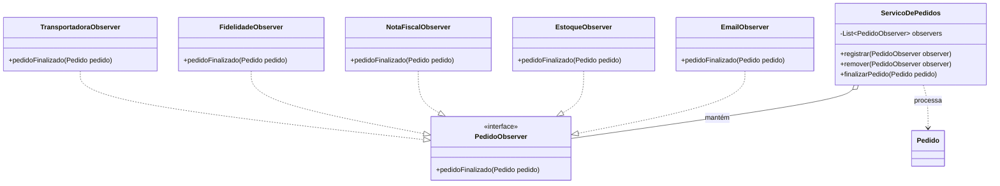

# 🛒 Sistema de Gestão de Pedidos (Padrão Observer)

Este projeto é uma implementação robusta do padrão de projeto comportamental **Observer**, desenvolvido como trabalho final para a disciplina de **Programação Orientada a Objetos Avançada**.

*   **Curso:** Bacharelado em Engenharia de Software
*   **Disciplina:** Programação Orientada a Objetos Avançada
*   **Professor:** Mario Jorge
*   **Semestre:** 4º Semestre (2026.2)
*   **Equipe:**
    *   Emanuel Ferreira
    *   Filipe Pinho
    *   Kauã Araújo 
    *   Marcio Ventura
    *   Rodrigo dos Santos

## Arquitetura do Projeto

O sistema simula o fluxo de finalização de um pedido em um e-commerce, onde diversos sistemas periféricos precisam reagir ao evento de "pedido finalizado" de forma independente e desacoplada. A aplicação foca no desacoplamento entre o **Sujeito (Subject)** e seus **Observadores (Observers)**.

### Diagrama de Classes (Mermaid)



### Componentes Principais

1.  **Sujeito (`ServicoDePedidos`)**: Gerencia a lista de observadores e notifica-os quando um pedido é concluído. Não conhece as implementações concretas dos observadores.
2.  **Interface Observer (`PedidoObserver`)**: Define o contrato que todas as ações pós-venda devem seguir.
3.  **Observadores Concretos**:
    *   `EmailObserver`: Envio de comunicações.
    *   `EstoqueObserver`: Abatimento de inventário.
    *   `NotaFiscalObserver`: Emissão de documentos fiscais.
    *   `FidelidadeObserver`: Cálculo de pontos/recompensas.
    *   `TransportadoraObserver`: Agendamento de logística.

## 🚀 Como Rodar o Projeto

### 1. Clonando o Repositório
Abra o seu terminal e execute:
```bash
git clone https://github.com/SEU-USUARIO/projeto-observer-poo-avancada.git
cd projeto-observer-poo-avancada
```

### 2. Pré-requisitos
*   **Java JDK 11** ou superior instalado.
*   Variável de ambiente `JAVA_HOME` configurada.
*   **Git** instalado.

### 3. Execução por Sistema Operacional

> **Dica:** Se você utiliza o **VS Code** ou **IntelliJ**, basta abrir a pasta raiz e clicar em "Run" na classe `Main.java`. A IDE cuidará da compilação automaticamente.

#### 🐧 Linux e 🍎 macOS
1.  Abra o terminal na pasta raiz do projeto.
2.  Compile o código:
    ```bash
    mkdir -p bin
    javac -d bin -sourcepath src src/br/com/loja/Main.java
    ```
3.  Execute a aplicação:
    ```bash
    java -cp bin br.com.loja.Main
    ```

#### 🪟 Windows
1.  Abra o CMD ou PowerShell na pasta raiz do projeto.
2.  Compile o código:
    ```cmd
    if not exist bin mkdir bin
    javac -d bin -sourcepath src src/br/com/loja/Main.java
    ```
3.  Execute a aplicação:
    ```cmd
    java -cp bin br.com.loja.Main
    ```

---


## Estrutura de Arquivos

```text
src/br/com/loja/
├── modelo/      # Entidades (Pedido, Produto, Cliente, ItemPedido)
├── observer/    # Interface e Implementações do Padrão Observer
├── servico/    # Lógica de Negócio (ServicoDePedidos)
└── Main.java    # Demonstração do fluxo e registro dinâmico
```

## Conceitos Aplicados

*   **DIP (Dependency Inversion Principle)**: O serviço de pedidos depende de uma interface, não de classes concretas.
*   **OCP (Open/Closed Principle)**: Novos comportamentos podem ser adicionados (novos observadores) sem modificar o código do serviço de pedidos.
*   **Tratamento de Exceções no Loop**: Implementado isolamento de falhas para garantir que um erro em um observador não interrompa os demais.
*   **Encapsulamento**: Uso de `Collections.unmodifiableList` para proteger o estado interno das entidades.

---
**Projeto desenvolvido pela Equipe de POO Avançada.**
